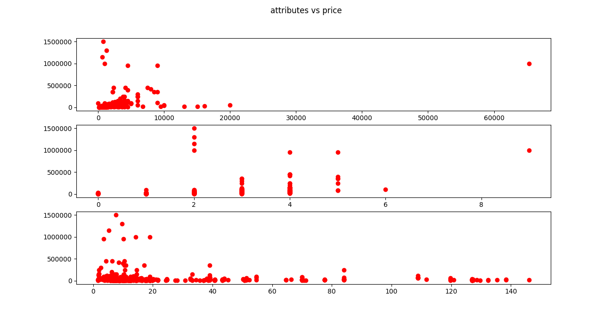
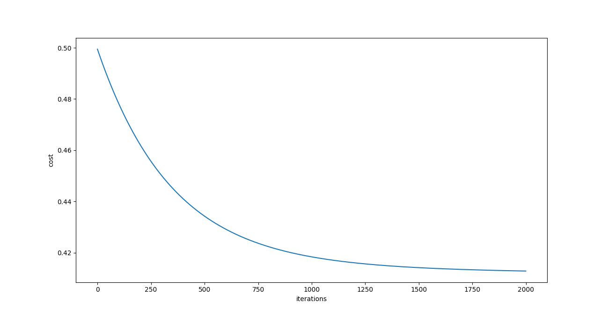

# HousePrice

This Repository Holds two Folders ScrapData and Regression Model

## Scrap Data
Contains all relavant scripts to get data and to modify / filter it

##Regression model
Contains all models implemented , with graphs

This Repo holds code to scrap real-time data from 99acres.com and build linearregression regression model from scratch

Attributes ex :bedrooms, distance,area vs price :

Decrease in cost over repeated iteration in gradientdescent :

TODO :

[ ] add different models to improve accuracy
[ ] improve linearregression model to Predict accurate Price
